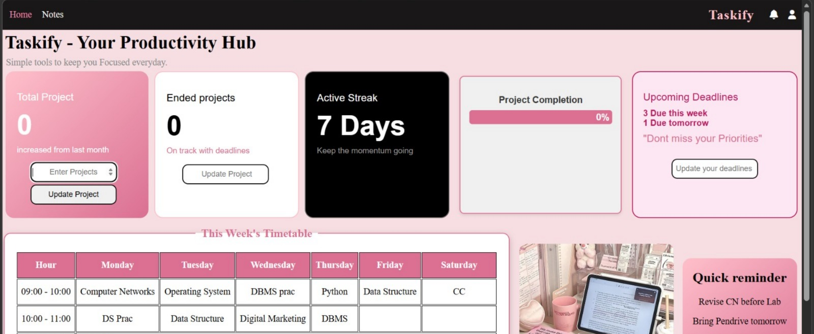
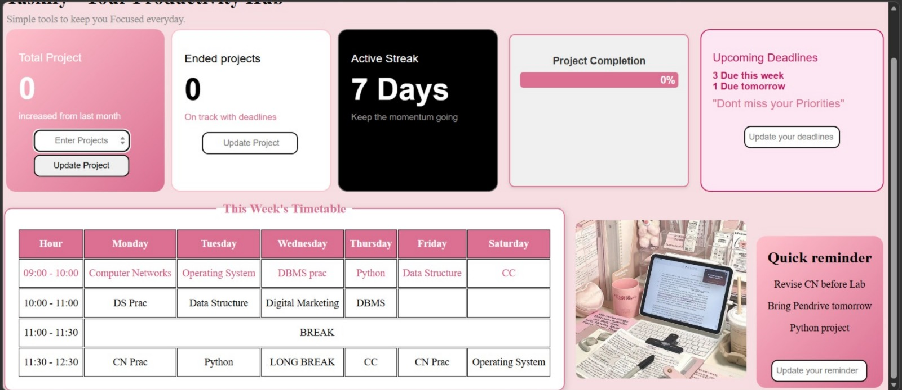
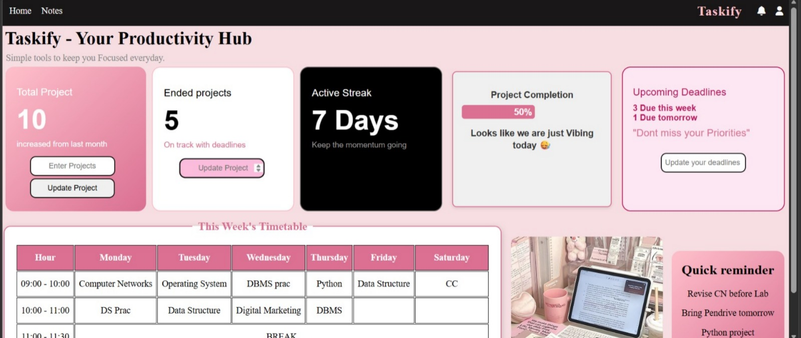
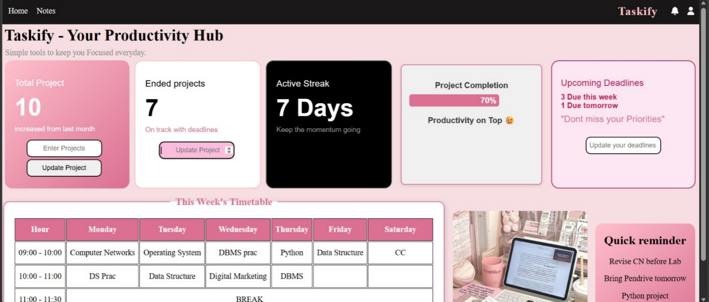
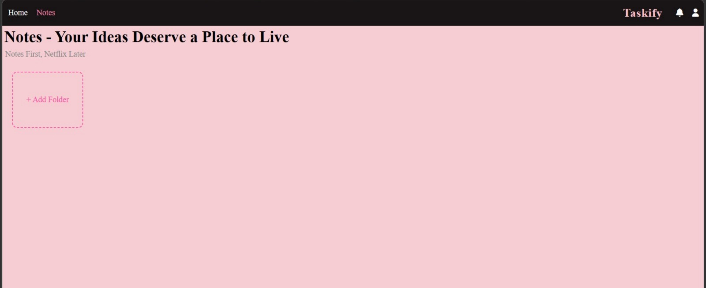
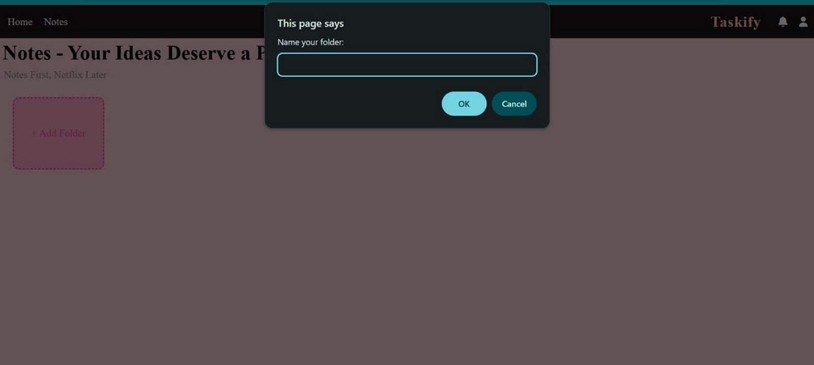
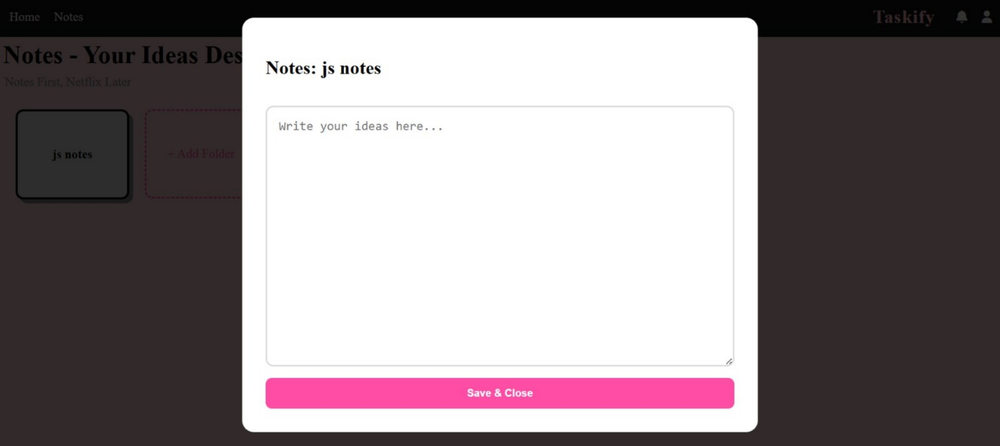
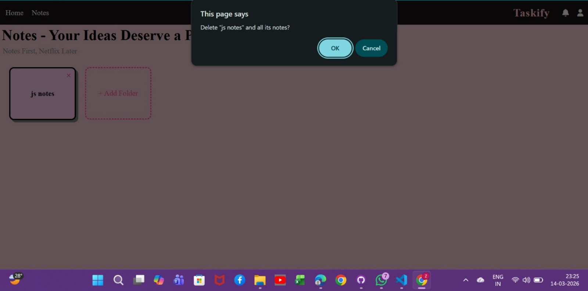

# Taskify-Student-productivity_Dashboard
A student productivity dashboard to manage projects, notes, reminders, and weekly schedules.

 Features:-
- Add and update projects
- Project completion tracker
- Productivity message based on completion percentage
- Notes section with local storage
- Weekly timetable layout
- Quick reminders
- Upcoming deadlines section
- Clean dashboard UI

Tech Stack:-
- HTML  
- CSS  
-JavaScript  

Screenshots

 Notes Section
 

Project Purpose:
This project was created to practice front-end development and build a productivity tool for students to manage tasks, notes, and schedules in a simple dashboard interface.
